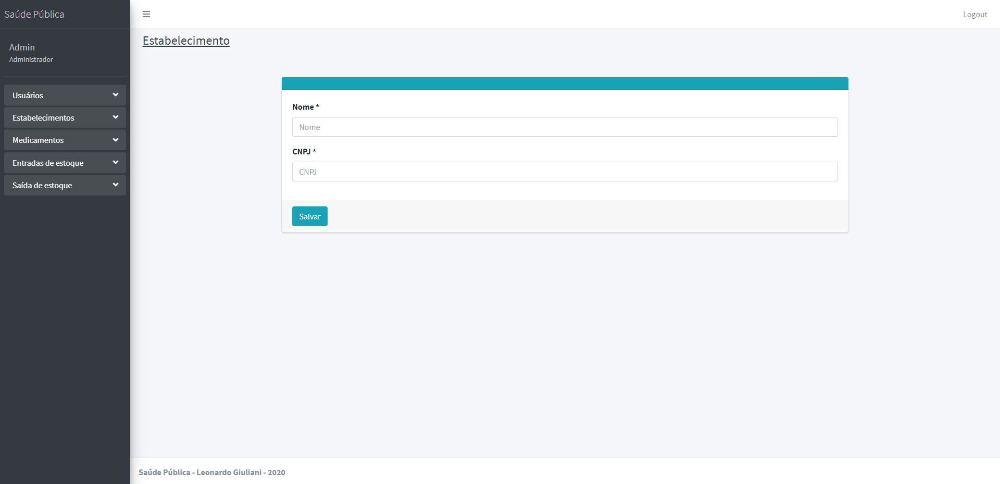

# Sistema de Saúde Pública
> Projeto de Trabalho de Conclusão de Curso da Pós-Graduação em Engenharia de Software

O projeto se baseia na criação de um sistema para a gestão de saúde pública de uma cidade.

## Tecnologias

O projeto foi desenvolvido utilizando as seguintes tecnologias:

- Java 11
- Spring Boot (https://spring.io/projects/spring-boot)
- Thymeleaf (https://www.thymeleaf.org/)
- Mysql https://www.mysql.com/)
- Gradle (https://gradle.org/)

## Requisitos do Projeto

Os requisitos para se executar o projeto são os seguintes:

- Possuir Java 11 instalado.
- Possuir Mysql instalado.
- Caso necessário, acessar o arquivo application.properties dentro do projeto, e alterar as propriedades spring.datasource.username e spring.datasource.password para o valores do seus Mysql instalado.
- Após executar o projeto pela primeira vez, deve ser executado o script abaixo:
```sql
INSERT INTO saudepublica.user (id, cpf, email, name, password, type) VALUES (1, '59647181086', 'admin@admin.com', 'Admin', '$2a$10$3.rfzgEHq4z011VGx.kud.g2INDwbgICb67GPxdm8lC.jivK7DUPa', 'ADMIN');
```

## Acessando o sistema

Acesse o sistema pela URL http://localhost:8080/.

Vocês será redirecionado para a página de Login. O E-mail e Senha padrão sãp:

E-mail: admin@admin.com

Senha admin123

Após logar você será redirecionado para a página Home.

## Conhecendo o sistema

### Login


### Home


### Usuário

Listagem de usuários


Cadastro de usuário


### Estabelecimento

Listagem de estabelecimentos


Cadastro de estabelecimento


### Medicamento

Listagem de medicamentos


Cadastro de medicamento


### Entrada de Estoque

Listagem de entradas de Estoque


Cadastro de entrada de Estoque


### Saída de Estoque

Listagem de saídas de Estoque


Cadastro de saída de Estoque

